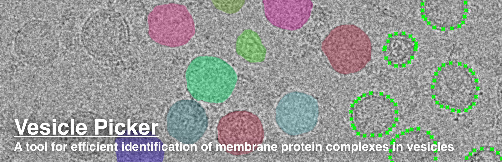

## Installation ##

1. Ensure [Anaconda](https://www.anaconda.com/download) or [Miniconda](https://docs.anaconda.com/miniconda/) is installed on your machine.  
2. If you wish to run the Segment Anything model on GPU, ensure [CUDA](https://docs.nvidia.com/cuda/) is installed on your machine. CUDA is not necessary if you wish to only run Segment Anything on your machine's CPU. 
3. Clone this repository:  
	```
	git clone https://github.com/r-karimi/vesicle-picker.git
	```
4. Enter this repository:
	```
	cd vesicle-picker
	```
5. Create a clean conda virtual environment.
	```
	conda create -n vesicle-picker
 	conda activate vesicle-picker
 	conda install pip
 	```
6. Edit the [`pyproject.toml`](pyproject.toml) file in the base directory to install the correction version of PyTorch, PyTorch vision, and PyTorch audio for your machine. These instructions differ based on whether you are installing PyTorch for CPU or GPU usage.

	### CPU Installation ###
	- Visit the [PyTorch](https://pytorch.org/get-started/locally/) installation page and select the appropriate options, ensuring that Pip is selected as the package manager and CPU is selected as the compute platform. Note the given install command.
 
	- Modify `install-pytorch` in `pyproject.toml` with this install command:
		```
 		# For CPU
 		install-pytorch = "pip install torch torchvision torchaudio --index-url https://download.pytorch.org/whl/cpu"
 		```

	### GPU Installation ###
	- Note your version of CUDA and Python by running:
		```
		nvcc --version
		python --version
		```
	- Browse the [PyTorch wheels](https://download.pytorch.org/whl/torch/) to find the appropriate versions of PyTorch, PyTorch vision, and PyTorch audio for your installed versions of CUDA and Python (e.g. `cu118` for CUDA 11.8 and `cp39` for Python 3.9).
 
	- Modify `install-pytorch` in `pyproject.toml` to match these versions:
		```
 		# For Python 3.9.X and CUDA 11.8
 		install-pytorch = "pip install torch==2.1.1+cu118 torchvision==0.16.1+cu118 torchaudio==2.1.1+cu118 -f https://download.pytorch.org/whl/torch_stable.html"
 		```
  
8. Install `vesicle-picker` and dependencies:
	```
	pip install .
	poe install-pytorch
 	```
9. Download the Segment Anything [model weights](https://github.com/facebookresearch/segment-anything#model-checkpoints) and place them in the `vesicle-picker` repository. We recommend trying with the ViT-L model weights first.
10. Modify csparc_login.ini to match your active CryoSPARC instance from which micrographs will be imported into Vesicle Picker and into which particle locations will be exported.

## Usage ##

Before processing your own dataset, we recommend working through the introductory Jupyter notebook [`tests/find_vesicles.ipynb`](tests/find_vesicles.ipynb). This notebook describes how the program imports data residing in cryosparc and describes each step of the processing pipeline.

To process your own dataset, follow the steps below:

### In CryoSPARC: ###

1. [Import](https://guide.cryosparc.com/processing-data/all-job-types-in-cryosparc/import/job-import-movies) your movies, then perform [patch motion correction](https://guide.cryosparc.com/processing-data/all-job-types-in-cryosparc/motion-correction/job-patch-motion-correction) and [patch CTF estimation](https://guide.cryosparc.com/processing-data/all-job-types-in-cryosparc/ctf-estimation/job-patch-ctf-estimation).
2. [Curate](https://guide.cryosparc.com/processing-data/all-job-types-in-cryosparc/exposure-curation/interactive-job-manually-curate-exposures) your motion-corrected micrographs.
3. Note the project ID, workspace ID, and job ID of your Curate Exposures job.

### In Vesicle Picker: ###

4. d
5.  

## Reference ##
